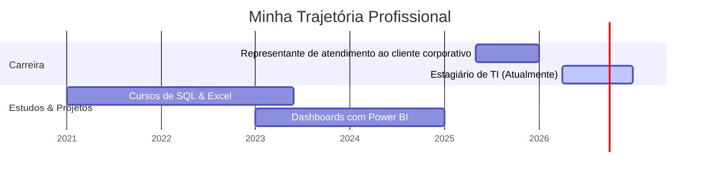

# Olá, eu sou o Thiago Soares 👋

### 📊 Analista de Business Intelligence & CRM
Atuo na transformação de dados em insights estratégicos para a tomada de decisão comercial e de negócios.

---

### 🛠️ Tecnologias & Ferramentas

---

### 📅 Linha do Tempo

---

### 📈 Estatísticas do GitHub

  
  

---

### 🌐 Onde me encontrar
- 💼 [LinkedIn](https://linkedin.com/in/tisoares2001)
- 🔗 [Linktree](https://linktr.ee/tisoares2001)
- ✉️ [Email](mailto:ti.soares2001@gmail.com)
